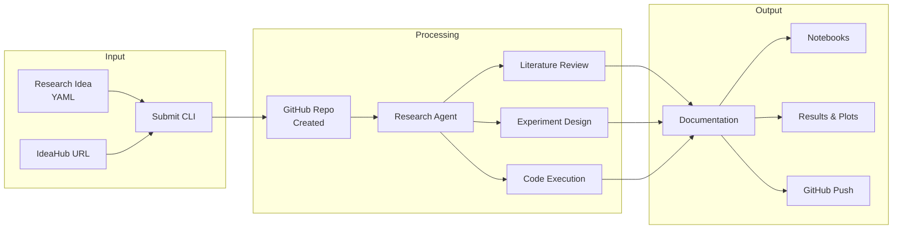

<div align="center">


[](https://github.com/ChicagoHAI/idea-explorer)
[](https://www.python.org/downloads/)
[](LICENSE)
[](https://x.com/YOUR_X_HANDLE)
[](https://discord.gg/YOUR_INVITE_CODE)

<!-- TODO: Replace YOUR_X_HANDLE and YOUR_INVITE_CODE with actual links -->

</div>

<hr>

Idea Explorer is an autonomous research framework that takes structured research ideas and orchestrates AI agents to design, execute, analyze, and document experiments across diverse domains.

<details open>
<summary><b>Key Features</b></summary>

| Feature | Description |
|---------|-------------|
| **Minimal Input** | Just provide title, domain, and hypothesis - agents handle the rest |
| **Agent-Driven Research** | Literature review, dataset search, baseline identification |
| **Multi-Provider Support** | Works with Claude, Gemini, and Codex via scribe |
| **Pragmatic Execution** | Creates resources when they don't exist, always proceeds |
| **Domain-Agnostic** | ML, data science, AI, systems, theory, and more |
| **Smart Documentation** | Auto-generates notebooks, reports, and code walkthroughs |
| **GitHub Integration** | Auto-creates repos and pushes results |

</details>

<details>
<summary><b>Quick Start</b></summary>

### Option A: Fetch from IdeaHub

```bash
# 0. Setup (one-time)
uv sync  # Install dependencies with uv
cp .env.example .env
# Edit .env and add your GITHUB_TOKEN and OPENAI_API_KEY

# 1. Fetch an idea from IdeaHub and auto-submit
python src/cli/fetch_from_ideahub.py https://hypogenic.ai/ideahub/idea/HGVv4Z0ALWVHZ9YsstWT --submit

# 2. Run the research
python src/core/runner.py <idea_id>
```

### Option B: Create Your Own Idea

```bash
# 0. Setup (one-time)
uv sync
cp .env.example .env
# Edit .env and add your GITHUB_TOKEN

# 1. Submit a research idea (creates GitHub repo & workspace)
python src/cli/submit.py ideas/examples/ml_regularization_test.yaml

# 2. (Optional) Add resources to workspace
cd workspace/<repo-name>
# Add datasets, documents, code, etc.
git add . && git commit -m "Add research resources" && git push

# 3. Run the research
cd ../..
python src/core/runner.py <idea_id>

# 4. Results automatically pushed to GitHub
```

</details>

<details>
<summary><b>System Architecture</b></summary>



**Directory Structure:**

```
ideas/
  submitted/      <- New research ideas
  in_progress/    <- Currently executing
  completed/      <- Finished research

workspace/<repo-name>/
  notebooks/      <- Jupyter notebooks (plan, docs, code walkthrough)
  results/        <- Metrics, plots, models
  logs/           <- Execution logs
  .idea-explorer/ <- Original idea spec
```

</details>

<details>
<summary><b>Research-First Philosophy</b></summary>

**You can submit minimal ideas** - agents will research the details:

- Just provide: title, domain, research question
- Agent searches for: datasets, baselines, evaluation methods
- Grounds in literature when resources exist
- Creates synthetic data/baselines when they don't
- Always proceeds to execution - doesn't get stuck

**Example minimal idea:**
```yaml
idea:
  title: "Do LLMs understand causality?"
  domain: artificial_intelligence
  hypothesis: "LLMs can distinguish causal from correlational relationships"
  # That's it! Agent handles the rest
```

**Full specification example:**
```yaml
idea:
  title: "Clear, descriptive title"
  domain: machine_learning
  hypothesis: "Specific, testable hypothesis"

  background:
    description: "Context and motivation"
    papers:
      - url: "https://arxiv.org/..."
        description: "Why this paper is relevant"
    datasets:
      - name: "Dataset name"
        source: "Where to get it"

  methodology:
    approach: "High-level strategy"
    steps: ["Step 1", "Step 2"]
    baselines: ["Baseline 1", "Baseline 2"]
    metrics: ["Metric 1", "Metric 2"]

  constraints:
    compute: gpu_required
    time_limit: 3600
```

See `ideas/schema.yaml` for full specification.

</details>

<details>
<summary><b>Supported Domains</b></summary>

| Domain | Examples |
|--------|----------|
| **Artificial Intelligence** | LLM evaluation, prompt engineering, AI agents, benchmarking |
| **Machine Learning** | Training, evaluation, hyperparameter tuning |
| **Data Science** | EDA, statistical analysis, visualization |
| **Systems** | Performance benchmarking, optimization |
| **Theory** | Algorithmic analysis, proof verification |
| **Scientific Computing** | Simulations, numerical methods |
| **NLP** | Language model experiments, text analysis |
| **Computer Vision** | Image processing, object detection |
| **Reinforcement Learning** | Agent training, policy evaluation |

</details>

<details>
<summary><b>Installation</b></summary>

```bash
# 1. Install uv (if not already installed)
curl -LsSf https://astral.sh/uv/install.sh | sh

# 2. Clone repository
git clone https://github.com/ChicagoHAI/idea-explorer
cd idea-explorer

# 3. Install dependencies
uv sync

# 4. Install scribe (for Jupyter integration)
# Follow instructions at: https://github.com/goodfire-ai/scribe

# 5. Configure environment
cp .env.example .env
# Edit .env and add your GITHUB_TOKEN and AI provider API keys
```

</details>

<details>
<summary><b>Usage Options</b></summary>

### Running Research

```bash
python src/core/runner.py <idea_id>

# Options:
#   --provider claude|gemini|codex  (default: claude)
#   --timeout SECONDS               (default: 3600)
#   --full-permissions              (allow agents to run without prompts)
#   --no-github                     (run locally without GitHub)
#   --github-org ORG                (specify GitHub org, default: ChicagoHAI)
```

### Permission Modes

```bash
# With permission prompts (default, safer)
python src/core/runner.py my_idea

# Full autonomous mode (faster, no interruptions)
python src/core/runner.py my_idea --provider codex --full-permissions
```

### Evaluate Quality (Optional)

```python
from src.evaluation.critic_runner import CriticRunner

runner = CriticRunner()
runner.evaluate_research(
    run_dir="runs/my_idea/",
    critics=["code_quality", "scientific_rigor", "reproducibility"]
)
```

</details>

<hr>

## Documentation

- **[docs/WORKFLOW.md](docs/WORKFLOW.md)** - Complete workflow guide
- **[docs/IDEAHUB_INTEGRATION.md](docs/IDEAHUB_INTEGRATION.md)** - IdeaHub integration
- **[DESIGN.md](DESIGN.md)** - Comprehensive design document
- **[GITHUB_INTEGRATION.md](GITHUB_INTEGRATION.md)** - GitHub setup and usage
- **[ideas/schema.yaml](ideas/schema.yaml)** - Full specification schema
- **[ideas/examples/](ideas/examples/)** - Example research ideas

## Contributing

Contributions welcome! Areas of interest:

- New domain templates (biology, chemistry, social science, etc.)
- Additional evaluation criteria
- Integration with experiment trackers
- Web interface
- Multi-agent collaboration features

## Citation

If you use Idea Explorer in research, please cite:

```bibtex
@software{idea_explorer_2025,
  title={Idea Explorer: Autonomous Research Framework},
  author={ChicagoHAI},
  year={2025},
  url={https://github.com/ChicagoHAI/idea-explorer}
}
```

## License

Apache 2.0 - See [LICENSE](LICENSE) file

<hr>

<div align="center">

**Ready to automate your research?**

```bash
python src/cli/submit.py ideas/examples/ml_regularization_test.yaml
```

For questions and feedback, [open an issue](https://github.com/ChicagoHAI/idea-explorer/issues) or join our [Discord](https://discord.gg/YOUR_INVITE_CODE).

</div>
