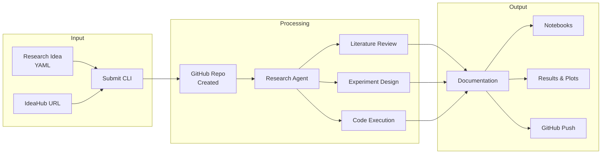

<div align="center">


[](https://github.com/ChicagoHAI/idea-explorer)
[](https://www.python.org/downloads/)
[](docker/)
[](LICENSE)
[](https://x.com/ChicagoHAI)
[](https://discord.gg/n65caV7NhC)

</div>

<hr>

Idea Explorer is an autonomous research framework that takes structured research ideas and orchestrates AI agents to design, execute, analyze, and document experiments across diverse domains.

<div align="center">

</div>

<details open>
<summary><b>Key Features</b></summary>

| Feature | Description |
|---------|-------------|
| **Minimal Input** | Just provide title, domain, and hypothesis - agents handle the rest |
| **Agent-Driven Research** | Literature review, dataset search, baseline identification |
| **Multi-Provider Support** | Works with Claude, Gemini, and Codex (raw CLI by default, notebooks optional) |
| **Pragmatic Execution** | Creates resources when they don't exist, always proceeds |
| **Domain-Agnostic** | ML, data science, AI, systems, theory, and more |
| **Smart Documentation** | Auto-generates reports, code, and results |
| **GitHub Integration** | Auto-creates repos and pushes results |

</details>

<details>
<summary><b>Quick Start</b></summary>

### Option A: Docker (Recommended)

Docker provides an isolated, reproducible environment with GPU support.

```bash
# 1. Clone and setup
git clone https://github.com/ChicagoHAI/idea-explorer
cd idea-explorer
cp .env.docker.example .env
# Edit .env with your API keys (ANTHROPIC_API_KEY, OPENAI_API_KEY, etc.)

# 2. Build container (one-time)
./idea-explorer build

# 3. Run! Fetch from IdeaHub and execute
./idea-explorer fetch https://hypogenic.ai/ideahub/idea/HGVv4Z0ALWVHZ9YsstWT \
    --submit --run --provider <YOUR_CLI> --full-permissions
```

The `--full-permissions` flag enables autonomous execution without permission prompts.

### Option B: Native Installation

For users who prefer running directly on their system without containers.

```bash
# 0. Setup (one-time)
uv sync  # Install dependencies with uv
cp .env.example .env
# Edit .env - see Configuration section below for details

# 1. One-liner: Fetch, submit, and run immediately
uv run python src/cli/fetch_from_ideahub.py https://hypogenic.ai/ideahub/idea/HGVv4Z0ALWVHZ9YsstWT \
    --submit --run --provider <YOUR_CLI> --full-permissions
```

### Create Your Own Idea

```bash
# Docker
./idea-explorer submit ideas/examples/ml_regularization_test.yaml
./idea-explorer run <idea_id> --provider <YOUR_CLI>  --full-permissions

# Native
uv run python src/cli/submit.py ideas/examples/ml_regularization_test.yaml
uv run python src/core/runner.py <idea_id> --provider <YOUR_CLI> --full-permissions
```

</details>

<details>
<summary><b>System Architecture</b></summary>



**Directory Structure:**

```
ideas/
  submitted/      <- New research ideas
  in_progress/    <- Currently executing
  completed/      <- Finished research

workspace/<repo-name>/
  .claude/skills/ <- Claude Code skills (paper-finder, literature-review, etc.)
  src/            <- Python scripts for experiments (default mode)
  results/        <- Metrics, plots, models
  logs/           <- Execution logs and transcripts
  artifacts/      <- Models, checkpoints
  notebooks/      <- Jupyter notebooks (only with --use-scribe)
  paper_draft/    <- LaTeX paper output (only with --write-paper)
  .idea-explorer/ <- Original idea spec
```

</details>

<details>
<summary><b>Research-First Philosophy</b></summary>

**You can submit minimal ideas** - agents will research the details:

- Just provide: title, domain, research question
- Agent searches for: datasets, baselines, evaluation methods
- Grounds in literature when resources exist
- Creates synthetic data/baselines when they don't
- Always proceeds to execution - doesn't get stuck

**Example minimal idea:**
```yaml
idea:
  title: "Do LLMs understand causality?"
  domain: artificial_intelligence
  hypothesis: "LLMs can distinguish causal from correlational relationships"
  # That's it! Agent handles the rest
```

**Full specification example:**
```yaml
idea:
  title: "Clear, descriptive title"
  domain: machine_learning
  hypothesis: "Specific, testable hypothesis"

  background:
    description: "Context and motivation"
    papers:
      - url: "https://arxiv.org/..."
        description: "Why this paper is relevant"
    datasets:
      - name: "Dataset name"
        source: "Where to get it"

  methodology:
    approach: "High-level strategy"
    steps: ["Step 1", "Step 2"]
    baselines: ["Baseline 1", "Baseline 2"]
    metrics: ["Metric 1", "Metric 2"]

  constraints:
    compute: gpu_required
    time_limit: 3600
```

See `ideas/schema.yaml` for full specification.

</details>

<details>
<summary><b>Supported Domains</b></summary>

| Domain | Examples |
|--------|----------|
| **Artificial Intelligence** | LLM evaluation, prompt engineering, AI agents, benchmarking |
| **Machine Learning** | Training, evaluation, hyperparameter tuning |
| **Data Science** | EDA, statistical analysis, visualization |
| **Systems** | Performance benchmarking, optimization |
| **Theory** | Algorithmic analysis, proof verification |
| **Scientific Computing** | Simulations, numerical methods |
| **NLP** | Language model experiments, text analysis |
| **Computer Vision** | Image processing, object detection |
| **Reinforcement Learning** | Agent training, policy evaluation |

</details>

<details>
<summary><b>Installation</b></summary>

### Option A: Docker (Recommended)

```bash
# 1. Clone repository
git clone https://github.com/ChicagoHAI/idea-explorer
cd idea-explorer

# 2. Configure environment
cp .env.docker.example .env
# Edit .env and add your API keys

# 3. Build container
./idea-explorer build

# 4. Login to CLI tools (one-time, if needed)
./idea-explorer login
# Inside the container, run: claude, codex, or gemini to authenticate
```

**CLI Authentication:** If you're already logged into Claude/Codex/Gemini on your host machine, credentials are automatically mounted into containers. Only run `./idea-explorer login` if you haven't authenticated these CLI tools before.

**Prerequisites for GPU support:**

```bash
# Install NVIDIA Container Toolkit
sudo apt install nvidia-container-toolkit
sudo nvidia-ctk runtime configure --runtime=docker
sudo systemctl restart docker
```

### Option B: Native Installation

```bash
# 1. Install uv (if not already installed)
curl -LsSf https://astral.sh/uv/install.sh | sh

# 2. Clone repository
git clone https://github.com/ChicagoHAI/idea-explorer
cd idea-explorer

# 3. Install dependencies
uv sync

# 4. (Optional) Install scribe for Jupyter notebook integration
# Only needed if you want to use --use-scribe flag
# Follow instructions at: https://github.com/goodfire-ai/scribe

# 5. Configure environment
cp .env.example .env
# Edit .env and add your API keys (see Configuration section below)
```

</details>

<details>
<summary><b>Configuration</b></summary>

### Environment Variables (.env)

Copy `.env.example` to `.env` and configure:

| Variable | Required | Description |
|----------|----------|-------------|
| `GITHUB_TOKEN` | Yes | GitHub Personal Access Token. [Generate here](https://github.com/settings/tokens) with `repo` and `write:org` scopes |
| `OPENAI_API_KEY` | Yes* | For IdeaHub integration. [Generate here](https://platform.openai.com/api-keys). *Not needed if not using IdeaHub |
| `GITHUB_ORG` | No | Your GitHub organization (default: ChicagoHAI) |
| `ANTHROPIC_API_KEY` | No | For Claude provider |
| `GOOGLE_API_KEY` | No | For Gemini provider |

### Workspace Configuration

Research workspaces are created in the directory specified by `config/workspace.yaml`.

**Default:** `workspace/` in the project root (already gitignored, works out of the box)

**To customize:** Copy `config/workspace.yaml.example` to `config/workspace.yaml` and edit `parent_dir`:

```yaml
workspace:
  parent_dir: "/path/to/your/workspaces"  # Your custom path
  auto_create: true
```

The `workspace.yaml` file is gitignored, so your local settings won't be pushed.

</details>

<details>
<summary><b>Usage Options</b></summary>

### Running Research

```bash
# Docker (recommended)
./idea-explorer run <idea_id> --provider <YOUR_CLI> --full-permissions

# Native
uv run python src/core/runner.py <idea_id> --provider <YOUR_CLI> --full-permissions
```

**Available options:**
| Option | Description |
|--------|-------------|
| `--provider claude\|gemini\|codex` | AI provider (default: claude) |
| `--timeout SECONDS` | Execution timeout (default: 3600) |
| `--full-permissions` | Allow agents to run without prompts |
| `--no-github` | Run locally without GitHub integration |
| `--github-org ORG` | GitHub organization (default: GITHUB_ORG env var) |
| `--use-scribe` | Enable Jupyter notebook integration |
| `--write-paper` | Generate academic paper after experiments |
| `--paper-style neurips\|icml\|acl` | Paper format style (default: neurips) |

### Common Commands

```bash
# Docker
./idea-explorer fetch <url>              # Fetch from IdeaHub
./idea-explorer fetch <url> --submit     # Fetch and submit
./idea-explorer submit <idea.yaml>       # Submit an idea
./idea-explorer run <id> [options]       # Run research
./idea-explorer shell                    # Interactive shell

# Native
uv run python src/cli/fetch_from_ideahub.py <url>
uv run python src/cli/submit.py <idea.yaml>
uv run python src/core/runner.py <id> [options]
```

### Execution Modes

```bash
# Default mode: Raw CLI (recommended)
# Agents write Python scripts, simpler and more unified across providers
./idea-explorer run my_idea --provider <YOUR_CLI> --full-permissions

# Notebook mode: With scribe (optional, native only)
# Agents get Jupyter notebook access via MCP tools
uv run python src/core/runner.py my_idea --provider <YOUR_CLI> --full-permissions --use-scribe
```

### Permission Modes

```bash
# With permission prompts (default, safer)
./idea-explorer run my_idea

# Full autonomous mode (faster, no interruptions)
./idea-explorer run my_idea --provider <YOUR_CLI> --full-permissions
```

### Evaluate Quality (Optional)

```python
from src.evaluation.critic_runner import CriticRunner

runner = CriticRunner()
runner.evaluate_research(
    run_dir="runs/my_idea/",
    critics=["code_quality", "scientific_rigor", "reproducibility"]
)
```

</details>

<hr>

## Documentation

- **[docs/WORKFLOW.md](docs/WORKFLOW.md)** - Complete workflow guide
- **[docs/IDEAHUB_INTEGRATION.md](docs/IDEAHUB_INTEGRATION.md)** - IdeaHub integration
- **[ARCHITECTURE_AND_ROADMAP.md](ARCHITECTURE_AND_ROADMAP.md)** - Architecture, template system, and roadmap
- **[DESIGN.md](DESIGN.md)** - Comprehensive design document
- **[GITHUB_INTEGRATION.md](GITHUB_INTEGRATION.md)** - GitHub setup and usage
- **[ideas/schema.yaml](ideas/schema.yaml)** - Full specification schema
- **[ideas/examples/](ideas/examples/)** - Example research ideas

### Customizing Agent Behavior

Agent prompts are stored as templates in `templates/`. To customize:

| What to Change | Template File |
|----------------|---------------|
| Experiment workflow (phases 1-6) | `templates/agents/session_instructions.txt` |
| Paper writing structure | `templates/agents/paper_writer.txt` |
| Resource finding behavior | `templates/agents/resource_finder.txt` |
| Research methodology | `templates/base/researcher.txt` |
| Domain-specific guidance | `templates/domains/<domain>/core.txt` |
| Claude Code skills | `templates/skills/<skill-name>/SKILL.md` |

See [ARCHITECTURE_AND_ROADMAP.md](ARCHITECTURE_AND_ROADMAP.md) for details on the template system.

## Contributing

Contributions welcome! Areas of interest:

- New domain templates (biology, chemistry, social science, etc.)
- Additional evaluation criteria
- Integration with experiment trackers
- Web interface
- Multi-agent collaboration features

## Citation

If you use Idea Explorer in research, please cite:

```bibtex
@software{idea_explorer_2025,
  title={Idea Explorer: Autonomous Research Framework},
  author={Haokun Liu, Chenhao Tan},
  year={2025},
  url={https://github.com/ChicagoHAI/idea-explorer}
}
```

## License

Apache 2.0 - See [LICENSE](LICENSE) file

<hr>

<div align="center">

**Ready to explore your research ideas?**

```bash
# Docker (recommended)
./idea-explorer submit ideas/examples/ml_regularization_test.yaml
./idea-explorer run <idea_id> --provider <YOUR_CLI> --full-permissions

# Native
uv run python src/cli/submit.py ideas/examples/ml_regularization_test.yaml
uv run python src/core/runner.py <idea_id> --provider <YOUR_CLI> --full-permissions
```

For questions and feedback, [open an issue](https://github.com/ChicagoHAI/idea-explorer/issues) or join our [Discord](https://discord.gg/BgkfTvBdbV).

</div>
