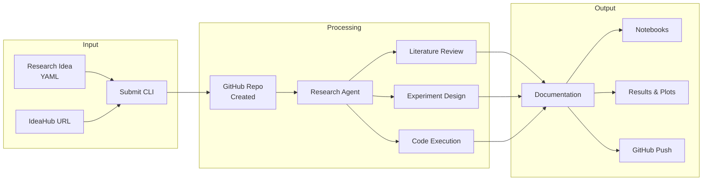

<div align="center">


[](https://github.com/ChicagoHAI/idea-explorer)
[](https://www.python.org/downloads/)
[](docker/)
[](LICENSE)
[](https://x.com/ChicagoHAI)
[](https://discord.gg/n65caV7NhC)

</div>

<hr>

Idea Explorer is an autonomous research framework that takes structured research ideas and orchestrates AI agents to design, execute, analyze, and document experiments across diverse domains.

<div align="center">

</div>

<details open>
<summary><b>Key Features</b></summary>

| Feature | Description |
|---------|-------------|
| **Minimal Input** | Just provide title, domain, and hypothesis - agents handle the rest |
| **Agent-Driven Research** | Literature review, dataset search, baseline identification |
| **Multi-Provider Support** | Works with Claude, Codex, and Gemini (raw CLI by default, notebooks optional) |
| **Pragmatic Execution** | Creates resources when they don't exist, always proceeds |
| **Domain-Agnostic** | ML, data science, AI, systems, theory, and more |
| **Smart Documentation** | Auto-generates reports, code, and results |
| **GitHub Integration** | Auto-creates repos and pushes results |

</details>

<details open>
<summary><b>Quick Start</b></summary>

**One-liner install** (clones repo, pulls Docker image, walks you through setup):

```bash
curl -fsSL https://raw.githubusercontent.com/ChicagoHAI/idea-explorer/main/install.sh | bash
```

**Or set up manually:**

```bash
# 1. Clone the repo (needed for CLI scripts, config, and templates)
git clone https://github.com/ChicagoHAI/idea-explorer
cd idea-explorer

# 2. Run the interactive setup wizard
./idea-explorer setup

# Or do each step yourself:
cp .env.example .env   # Edit .env: add GITHUB_TOKEN, OPENAI_API_KEY
docker pull ghcr.io/chicagohai/idea-explorer:latest    # Pull pre-built (~2 min)
docker tag ghcr.io/chicagohai/idea-explorer:latest chicagohai/idea-explorer:latest
claude   # Login to your AI CLI (one-time, on host machine)

# 3. Run from IdeaHub (easiest way to start)
./idea-explorer fetch https://hypogenic.ai/ideahub/idea/HGVv4Z0ALWVHZ9YsstWT \
    --submit --run --provider claude --full-permissions
```

That's it! The agent fetches the idea, creates a GitHub repo, runs experiments, and pushes results.

</details>

## Setup

### Docker (Recommended)

Docker provides an isolated environment with GPU support, CLI tools, LaTeX, and paper-finder pre-installed. The pre-built image includes everything — Python venvs, CLI tools (Claude/Codex/Gemini), LaTeX, and paper-finder — so you skip the long build step.

```bash
# Clone the repo (provides CLI scripts, config, templates, and idea examples)
git clone https://github.com/ChicagoHAI/idea-explorer
cd idea-explorer

# Option A: Pull pre-built image (faster, ~2 min download)
docker pull ghcr.io/chicagohai/idea-explorer:latest
docker tag ghcr.io/chicagohai/idea-explorer:latest chicagohai/idea-explorer:latest

# Option B: Build from source (~10-15 min)
./idea-explorer build

# Configure
cp .env.example .env   # Edit: add your API keys (see Configuration below)

# Login to your AI CLI (one-time, on your host machine)
claude   # or: codex, gemini
# Credentials are automatically mounted into containers
```

> **Note:** Cloning the repo is required even when pulling the pre-built image. The repo provides the `./idea-explorer` CLI, config files, templates, and idea examples. The Docker image provides the runtime environment (Python, tools, LaTeX). At runtime, config and templates are mounted from your local clone into the container, so you can customize them without rebuilding.

**GPU support** requires [NVIDIA Container Toolkit](https://docs.nvidia.com/datacenter/cloud-native/container-toolkit/install-guide.html):

```bash
sudo apt install nvidia-container-toolkit
sudo nvidia-ctk runtime configure --runtime=docker
sudo systemctl restart docker
```

### Native Installation

For users who prefer running directly on their system.

```bash
curl -LsSf https://astral.sh/uv/install.sh | sh   # Install uv
git clone https://github.com/ChicagoHAI/idea-explorer
cd idea-explorer
uv sync
cp .env.example .env   # Edit: add your API keys
claude   # Login to your AI CLI
```

## Configuration

### CLI Authentication

Claude Code, Codex, and Gemini CLIs use **OAuth login** (not API keys). Login once on your host machine:

```bash
claude    # or: codex, gemini
```

In Docker mode, credentials are automatically mounted into containers.

### Environment Variables (.env)

Copy `.env.example` to `.env` and configure:

| Variable | Required | Description |
|----------|----------|-------------|
| `GITHUB_TOKEN` | Recommended | GitHub Personal Access Token ([generate here](https://github.com/settings/tokens), `repo` scope) |
| `GITHUB_ORG` | No | GitHub org name (default: personal account) |
| `OPENAI_API_KEY` | For IdeaHub/paper-finder | Used for IdeaHub fetching, LLM repo naming, paper-finder |
| `S2_API_KEY` | No | Enables paper-finder literature search ([get here](https://www.semanticscholar.org/product/api)) |
| `COHERE_API_KEY` | No | Improves paper-finder ranking (~7% boost) |

Additional keys (`ANTHROPIC_API_KEY`, `GOOGLE_API_KEY`, `OPENROUTER_KEY`, `HF_TOKEN`, `WANDB_API_KEY`) are passed through to the agent environment.

**Setup tiers:**
- **Basic:** CLI login + `GITHUB_TOKEN` — full idea-explorer
- **Enhanced:** + `OPENAI_API_KEY` — LLM repo naming + IdeaHub support
- **Full:** + `S2_API_KEY` (+ optional `COHERE_API_KEY`) — paper-finder literature search

### Workspace Configuration

Research workspaces are created in the directory specified by `config/workspace.yaml`.

**Default:** `workspace/` in the project root (already gitignored).

**To customize:** Copy `config/workspace.yaml.example` to `config/workspace.yaml` and edit `parent_dir`:

```yaml
workspace:
  parent_dir: "/path/to/your/workspaces"
  auto_create: true
```

### Customizing Templates and Skills

Templates in `templates/` control agent behavior. In Docker mode, these are mounted from the host, so you can edit them without rebuilding:

| What to Change | Template File |
|----------------|---------------|
| Experiment workflow (phases 1-6) | `templates/agents/session_instructions.txt` |
| Paper writing structure | `templates/agents/paper_writer.txt` |
| Resource finding behavior | `templates/agents/resource_finder.txt` |
| Research methodology | `templates/base/researcher.txt` |
| Domain-specific guidance | `templates/domains/<domain>/core.txt` |
| Claude Code skills | `templates/skills/<skill-name>/SKILL.md` |

See [ARCHITECTURE_AND_ROADMAP.md](ARCHITECTURE_AND_ROADMAP.md) for details on the template system.

## Usage

### Fetch from IdeaHub (Easiest)

Browse ideas at [IdeaHub](https://hypogenic.ai/ideahub), then fetch and run:

```bash
# Docker
./idea-explorer fetch <ideahub_url> --submit --run --provider claude --full-permissions

# Native
uv run python src/cli/fetch_from_ideahub.py <ideahub_url> --submit --run --provider claude --full-permissions
```

This one command: fetches the idea, converts it to YAML, submits it, creates a GitHub repo, and runs the research agent.

You can also break it into steps:

```bash
./idea-explorer fetch <url>             # Just fetch and convert to YAML
./idea-explorer fetch <url> --submit    # Fetch, convert, and submit (creates GitHub repo)
```

### Submit Your Own Idea

Write an idea YAML (see examples in `ideas/examples/`) and submit:

```bash
# Docker
./idea-explorer submit ideas/examples/ml_regularization_test.yaml
./idea-explorer run <idea_id> --provider claude --full-permissions

# Native
uv run python src/cli/submit.py ideas/examples/ml_regularization_test.yaml
uv run python src/core/runner.py <idea_id> --provider claude --full-permissions
```

### Run Options

| Option | Description |
|--------|-------------|
| `--provider claude\|gemini\|codex` | AI provider (default: claude) |
| `--timeout SECONDS` | Execution timeout (default: 3600) |
| `--full-permissions` | Allow agents to run without prompts |
| `--no-github` | Run locally without GitHub integration |
| `--github-org ORG` | GitHub organization (default: `GITHUB_ORG` env var) |
| `--private` | Create private GitHub repository |
| `--no-hash` | Simpler repo names (skip random hash) |
| `--write-paper` | Generate LaTeX paper after experiments |
| `--paper-style neurips\|icml\|acl` | Paper format (default: neurips) |

### Other Commands

```bash
./idea-explorer shell       # Interactive shell inside the container
./idea-explorer login       # Login to CLI tools inside the container
./idea-explorer help        # Show all commands
```

<details>
<summary><b>System Architecture</b></summary>



**Directory Structure:**

```
ideas/
  submitted/      <- New research ideas
  in_progress/    <- Currently executing
  completed/      <- Finished research

workspace/<repo-name>/
  .claude/skills/ <- Claude Code skills (paper-finder, literature-review, etc.)
  src/            <- Python scripts for experiments (default mode)
  results/        <- Metrics, plots, models
  logs/           <- Execution logs and transcripts
  artifacts/      <- Models, checkpoints
  notebooks/      <- Jupyter notebooks (only with --use-scribe)
  paper_draft/    <- LaTeX paper output (only with --write-paper)
  .idea-explorer/ <- Original idea spec
```

</details>

<details>
<summary><b>Research-First Philosophy</b></summary>

**You can submit minimal ideas** - agents will research the details:

- Just provide: title, domain, research question
- Agent searches for: datasets, baselines, evaluation methods
- Grounds in literature when resources exist
- Creates synthetic data/baselines when they don't
- Always proceeds to execution - doesn't get stuck

**Example minimal idea:**
```yaml
idea:
  title: "Do LLMs understand causality?"
  domain: artificial_intelligence
  hypothesis: "LLMs can distinguish causal from correlational relationships"
  # That's it! Agent handles the rest
```

**Full specification example:**
```yaml
idea:
  title: "Clear, descriptive title"
  domain: machine_learning
  hypothesis: "Specific, testable hypothesis"

  background:
    description: "Context and motivation"
    papers:
      - url: "https://arxiv.org/..."
        description: "Why this paper is relevant"
    datasets:
      - name: "Dataset name"
        source: "Where to get it"

  methodology:
    approach: "High-level strategy"
    steps: ["Step 1", "Step 2"]
    baselines: ["Baseline 1", "Baseline 2"]
    metrics: ["Metric 1", "Metric 2"]

  constraints:
    compute: gpu_required
    time_limit: 3600
```

See `ideas/schema.yaml` for full specification.

</details>

<details>
<summary><b>Supported Domains</b></summary>

| Domain | Examples |
|--------|----------|
| **Artificial Intelligence** | LLM evaluation, prompt engineering, AI agents, benchmarking |
| **Machine Learning** | Training, evaluation, hyperparameter tuning |
| **Data Science** | EDA, statistical analysis, visualization |
| **Systems** | Performance benchmarking, optimization |
| **Theory** | Algorithmic analysis, proof verification |
| **Scientific Computing** | Simulations, numerical methods |
| **NLP** | Language model experiments, text analysis |
| **Computer Vision** | Image processing, object detection |
| **Reinforcement Learning** | Agent training, policy evaluation |

</details>

<details>
<summary><b>Paper-Finder Integration</b></summary>

When `S2_API_KEY` and `OPENAI_API_KEY` are set, the container automatically starts the paper-finder service for high-quality literature search with relevance ranking.

- **With paper-finder:** Agents get ranked, relevant papers via Semantic Scholar + LLM scoring
- **Without paper-finder:** Agents fall back to manual search (arXiv, Semantic Scholar, Papers with Code)
- **Optional `COHERE_API_KEY`:** Adds reranking for ~7% quality improvement

Paper-finder starts automatically in Docker — no extra setup needed.

</details>

## Documentation

- **[docs/WORKFLOW.md](docs/WORKFLOW.md)** - Complete workflow guide
- **[docs/IDEAHUB_INTEGRATION.md](docs/IDEAHUB_INTEGRATION.md)** - IdeaHub integration
- **[ARCHITECTURE_AND_ROADMAP.md](ARCHITECTURE_AND_ROADMAP.md)** - Architecture, template system, and roadmap
- **[DESIGN.md](DESIGN.md)** - Comprehensive design document
- **[docs/GITHUB_INTEGRATION.md](docs/GITHUB_INTEGRATION.md)** - GitHub setup and usage
- **[ideas/schema.yaml](ideas/schema.yaml)** - Full specification schema
- **[ideas/examples/](ideas/examples/)** - Example research ideas

## Contributing

Contributions welcome! Areas of interest:

- New domain templates (biology, chemistry, social science, etc.)
- Additional evaluation criteria
- Integration with experiment trackers
- Web interface
- Multi-agent collaboration features

## Citation

If you use Idea Explorer in research, please cite:

```bibtex
@software{idea_explorer_2025,
  title={Idea Explorer: Autonomous Research Framework},
  author={Haokun Liu, Chenhao Tan},
  year={2025},
  url={https://github.com/ChicagoHAI/idea-explorer}
}
```

## Acknowledgments

Some skills in `templates/skills/` were inspired by [claude-scientific-skills](https://github.com/K-Dense-AI/claude-scientific-skills) (MIT License, K-Dense Inc.). See [NOTICE](NOTICE) for details.

## License

Apache 2.0 - See [LICENSE](LICENSE) file

<hr>

<div align="center">

**Ready to explore your research ideas?**

```bash
./idea-explorer fetch https://hypogenic.ai/ideahub/idea/YOUR_IDEA_ID \
    --submit --run --provider claude --full-permissions
```

For questions and feedback, [open an issue](https://github.com/ChicagoHAI/idea-explorer/issues) or join our [Discord](https://discord.gg/BgkfTvBdbV).

</div>
